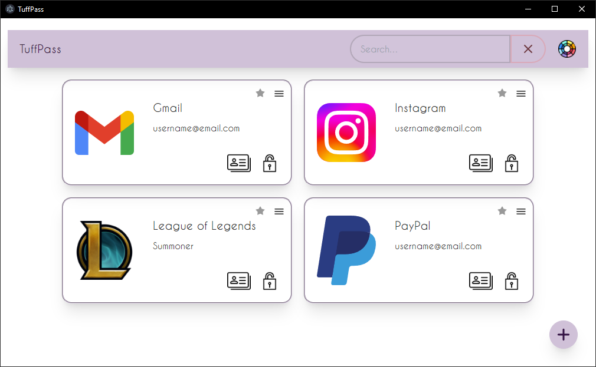

# TuffPass

TuffPass is an offline password manager for Windows, which is trying to keep itself lightweight and simple, while providing the user a fast and reliable experience. It is developed with [Svelte](https://svelte.dev/) and [Electron](https://www.electronjs.org/).

# How to install

### Recommended way
Download and run the latest `TuffPass.Setup.1.x.x.exe` in the [Releases](https://github.com/Ediz97/TuffPass/releases) section under `Assets`.

### Compiling on your own ([Node.js](https://nodejs.org/en) required)
1. Clone or download the repository
2. In the CLI, navigate to the root folder of TuffPass
3. Enter `npm install`
4. Enter `npm run dist`
5. Install the setup file from the newly created `dist` folder

# Features
- storing user names and passwords
- password strength bar, indicating the strength of the password
- automatically generating strong passwords
- copying user name or password to the clipboard with a single click
- search bar
- selecting custom icons, supporting every modern format (including gifs!)
- marking specific accounts as favorites, making them appear first in the list
- editing and removing accounts
- selecting from over 20 color themes!

# Is TuffPass safe?

All passwords are only stored locally on your machine, after being encrypted with modern encryption standards. The master password gets hashed with a salt. Entering the wrong master password five times locks you out for 10 seconds, in order to make brute force attempts more difficult.

# Using own icons for your accounts

In the root directory of TuffPass, you will find an `icons` folder. I highly recommend putting your icons in there and only using this directory when selecting your icons, as you will be able to transfer them to another device seamlessly this way, since the program uses relative paths to display the icons.

# How can I transfer my accounts to another device?

All of your account data are stored in the `userAccounts.json` file, and all of your custom icons are ideally stored in the `icons` folder in the root directory of the program. Make a copy of them, and move them to the new root directory after installing TuffPass.